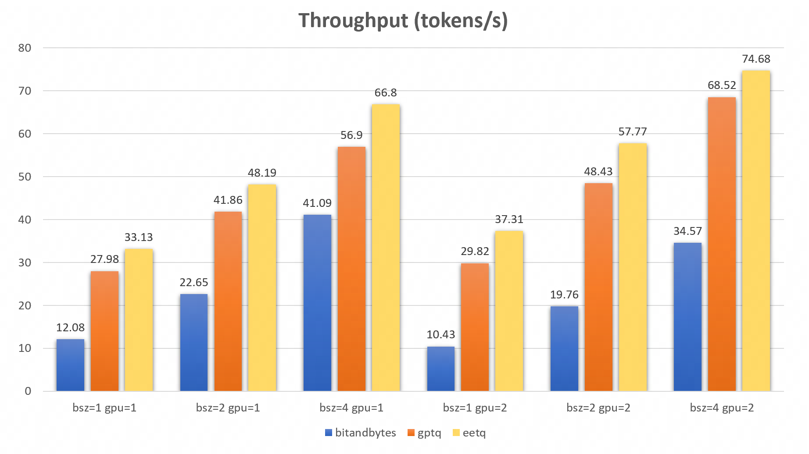

# EETQ

EETQ(Easy & Efficient Quantization for Transformers)是一款针对transformer模型的量化工具

## 目录

- [EETQ](#eetq)
  - [目录](#目录)
  - [特点](#特点)
  - [快速开始](#快速开始)
    - [环境](#环境)
    - [安装](#安装)
    - [使用](#使用)
  - [参考用例](#参考用例)
  - [性能测试](#性能测试)

## 特点

- 高性能的INT8权重训练后量化算子

  * 提取自[FasterTransformer](https://github.com/NVIDIA/FasterTransformer/tree/main/src/fastertransformer/kernels/cutlass_kernels/fpA_intB_gemm)的高性能GEMM内核，可以更加方便集成至您的项目中

  * 无需量化感知训练

- 使用[Flash-Attention V2](https://github.com/Dao-AILab/flash-attention)优化attention的推理性能

- 简单易用，只需一行代码即可适配您的PyTorch模型
## 快速开始

### 环境

* cuda:>=11.4
* python:>=3.8 
* gcc:>= 7.4.0 
* torch:>=1.14.0 
* transformers:>=4.27.0

### 安装
推荐使用Dockerfile.
```bash
$ git clone https://github.com/NetEase-FuXi/EETQ.git
$ cd EETQ/
$ git submodule update --init --recursive
$ pip install .
```
如果您的设备内存小于96GB，并且CPU核数很多，Ninja可能会运行过多的并行编译任务，可能会耗尽设备内存。为了限制并行编译任务的数量，您可以设置环境变量MAX_JOBS：
```bash
$ MAX_JOBS=4 pip install .
```
### 使用
1. 量化torch模型
```python
from eetq.utils import eet_quantize
eet_quantize(torch_model, init_only=False, include=[nn.Linear], exclude=["lm_head"], device="cuda:0")
```


2. 量化torch模型并使用flash attention优化
```python
...
model = AutoModelForCausalLM.from_pretrained(model_name, config=config, torch_dtype=torch.float16)
from eetq.utils import eet_accelerator
eet_accelerator(model, quantize=True, fused_attn=True, dev="cuda:0")
model.to("cuda:0")

# 推理
res = model.generate(...)

```

3. 在TGI中使用eetq进行量化加速
[PR链接](https://github.com/huggingface/text-generation-inference/pull/1018)
```bash
--quantize eetq
```

## 参考用例

- [examples/models/llama_transformers_example.py](examples/models/llama_transformers_example.py)

## 性能测试

- llama-13b (test on 3090)

